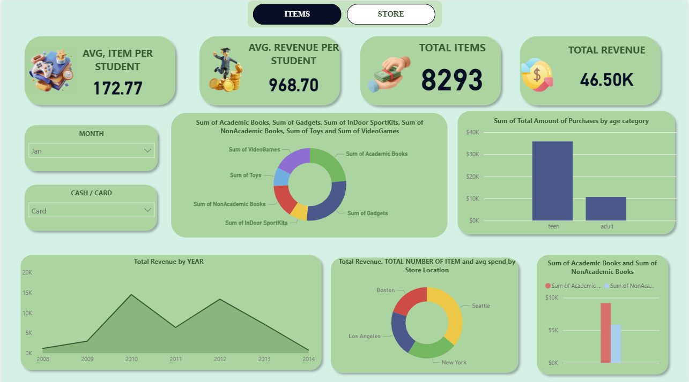
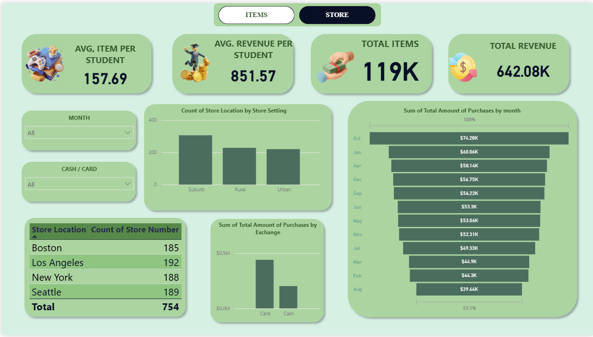

# Student Purchase and Revenue Analysis Dashboard (Power BI)

A multi-page Power BI dashboard built on a Student Survey dataset to analyze student purchasing behavior across store locations. The report highlights revenue trends, product category preferences, spending patterns by age group, payment method split, and store-level performance using interactive, filterable visuals.

---

## Dashboard Preview

### Items Page


### Store Page


---

## Overview

This report contains two analytical pages:

### Page 1: Items
Focuses on what students purchase and how spending varies across categories and age groups.

**Visuals**
- KPI cards: Total Revenue, Average Revenue per Student, Average Items per Student, Cash/Card split
- Donut chart: Purchase distribution by product category
- Clustered column chart: Category-wise spending by age group
- Area chart: Revenue trend over time (monthly/yearly)
- Slicers: Year, Month, Age Category

### Page 2: Store
Focuses on store performance and comparisons across store location and setting.

**Visuals**
- KPI cards: Total Revenue, Total Items, Average Spend per Visit
- Clustered column chart: Revenue by store location
- Line and stacked column combo: Revenue vs. item count over time
- Funnel chart: Store ranking by volume/conversion proxy
- Detail table: Store-level performance breakdown
- Slicers: Store Setting, Store Location, Year

---

## Data Model

**Table:** `Student Survey`

**Key columns**
- `Store Number`: Unique store identifier
- `Store Location`: Geographic location of the store
- `Store Setting`: Store environment/type (e.g., urban, suburban)
- `age category`: Student age bracket
- `YEAR`, `month`: Time dimensions
- `Exchange`: Payment method (Cash/Card)

**Product categories**
- Academic Books
- NonAcademic Books
- Gadgets
- Toys
- VideoGames
- InDoor SportKits

---

## Measures (DAX)

The dashboard uses the following measures:
- `Total Revenue`
- `Total Amount of Purchases`
- `TOTAL NUMBER OF ITEM`
- `Avg Revenue per student`
- `Avg Items per Student`
- `avg spend`

Note: Measures are defined inside the Power BI report (`.pbix`) file.

---

## Tools and Technologies

- Power BI Desktop: Data modeling and report development
- Power Query (M): Data transformation and cleaning
- DAX: KPI and metric calculations
- CityPark Theme: Report styling and layout consistency

---

## Repository Structure

```text
.
├── student analysis.pbix     # Power BI report file
├── assets/
│   ├── items-dashboard.png   # Screenshot: Items page
│   └── store-dashboard.png   # Screenshot: Store page
└── README.md                 # Project documentation
```

---

## How to Open the Report

1. Install Power BI Desktop.
2. Clone or download this repository.
3. Open `student analysis.pbix` in Power BI Desktop.
4. Use the page navigation and slicers to explore the report.

---

## Key Insights Supported

- Which product categories generate the most revenue?
- How does average revenue per student vary by store location?
- What are the monthly and yearly revenue trends?
- How do purchasing behaviors differ by age category?
- Which stores perform best by revenue, volume, and average spend?
- What is the cash vs. card payment split across the dataset?

---

## Notes

- Dataset sourced from a student consumer survey.
- Data is anonymized and used for educational/portfolio purposes.

---

## Author

Jiya  
GitHub: https://github.com/JIYA1220
